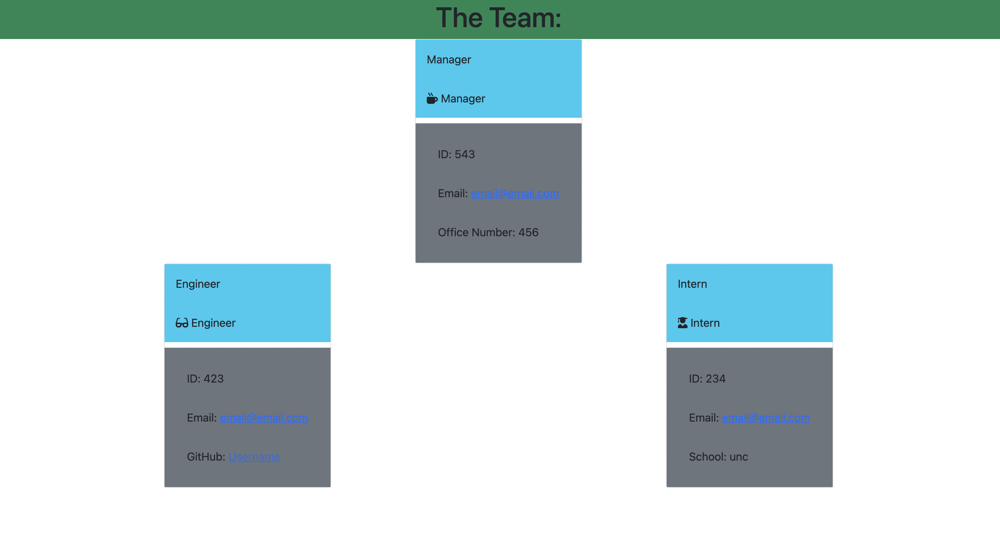

# Challenge #10 - Team Profile Generator

## Description

    This challenge used Node.js and the npm inquirer package (along with jest) to create a profile for a team that could be used in a workplace setting. The user enters in the information designated by the prompts and is given a generated html document with the information.

## Experience Gained

    Overall, this challenge was not terribly difficult, but there was one problem that I could not get resolved. The new html document does not generate. However, through rewriting this program so many times, I did modify the structure in various ways. Having more experience navigating through a large codebase let me find many other small bugs and correct them.

## GitHub Links (Repository and Demo Video)

    The repository link: https://github.com/ekball/C10-Team-Profile-Generator

    The demo video link: https://drive.google.com/file/d/1w22yWb29l64Q6_nCPyZ75UoooB6llpFr/view

## Demo README

